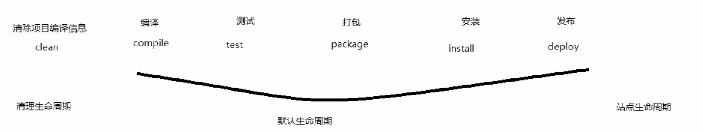
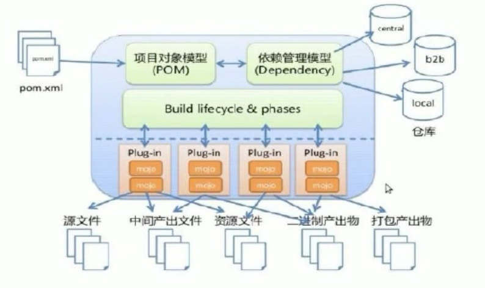
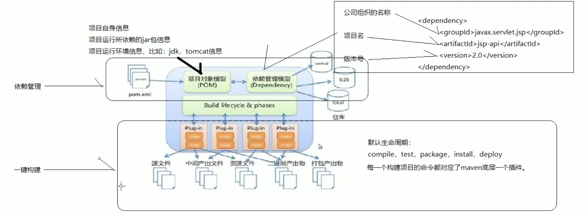
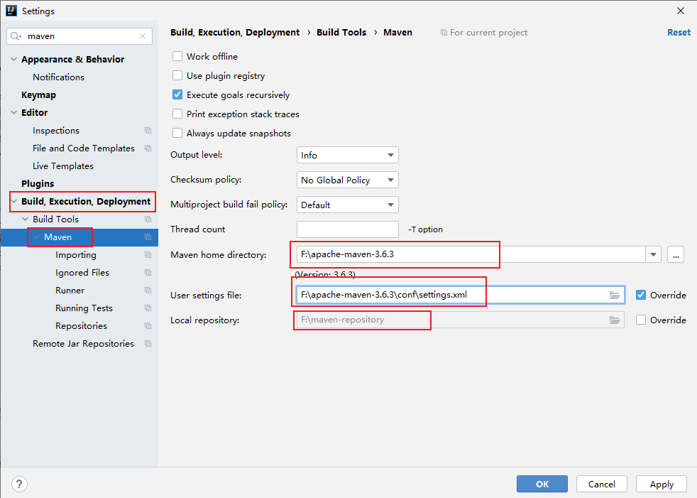
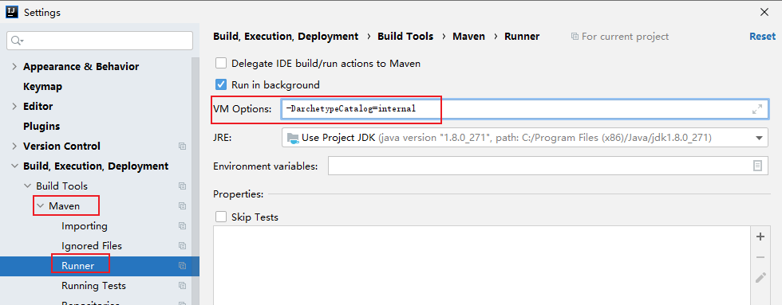
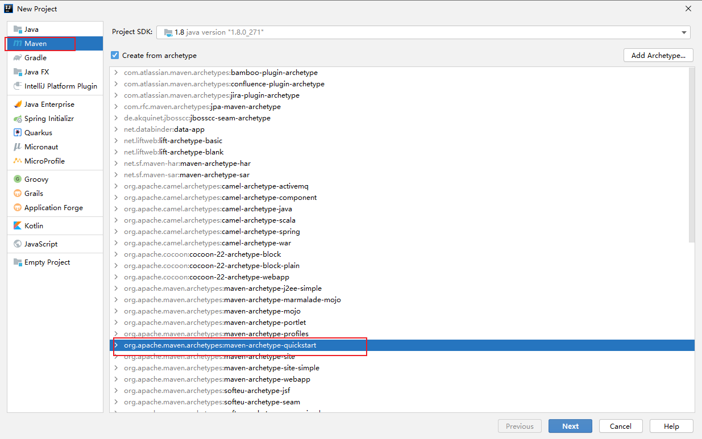
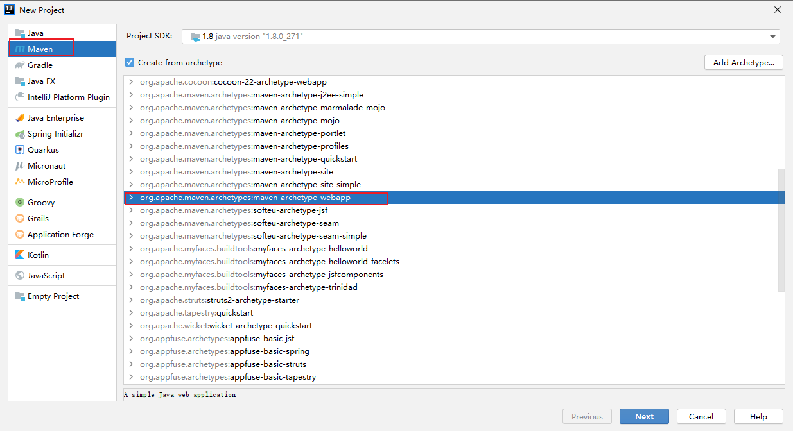

# Maven定义

Maven是一个[项目管理工具](https://baike.baidu.com/item/项目管理工具)，它包含了一个项目对象模型 (Project Object Model)，一组标准集合，一个[项目生命周期](https://baike.baidu.com/item/项目生命周期)(Project Lifecycle)，一个依赖管理系统(Dependency Management System)，和用来运行定义在生命周期阶段(phase)中[插件](https://baike.baidu.com/item/插件)(plugin)目标(goal)的逻辑。当你使用Maven的时候，你用一个明确定义的项目对象模型来描述你的项目，然后Maven可以应用横切的逻辑，这些逻辑来自一组共享的（或者自定义的）插件。

# Maven的功能

1. 依赖管理：maven工程对jar包的管理过程。

2. 一件构建

   构建指的是项目从编译、测试、运行、打包、安装、部署整个过程都交给maven进行管理。

   一件构建指的是整个构建过程，使用maven一个命令可以轻松完成整个工作。

# Maven项目标准目录结构

## 一个完整的项目由以下几个部分组成：

- 核心代码部分
- 配置文件部分
- 测试代码部分
- 测试配置文件部分

## Maven项目标准目录结构

- src/main/jave	核心代码部分
- src/main/resources     配置文件部分
- src/test/java     测试代码部分
- src/test/resources    测试配置文件部分
- src/main/webapp    页面资源，js,css,图片等等

## Maven常用命令

| 命令          | 解释                                                         |
| ------------- | ------------------------------------------------------------ |
| mvn  clean    | 对项目进行清理，会删除target目录。（新接手项目时要使用）     |
| mvn  compile  | 编译项目源代码。                                             |
| mvn  test     | 编译项目、测试源代码                                         |
| mvn   package | 编译项目、测试源代码、打包，存放在target 目录下              |
| mvn  install  | 编译项目、测试源代码、打包，存放在target 目录下， 放入本地仓库中 |

## Maven生命周期

## Maven概念模型图

## IDEA中集成Maven插件

前提条件：电脑中已经安装好了Maven。

配置参数`-DarchetypeCatalog=internal`,没有网络时可以找到之前下载的配置文件

## 使用骨架创建Maven的Java工程

## 使用骨架创建Maven的Web工程

