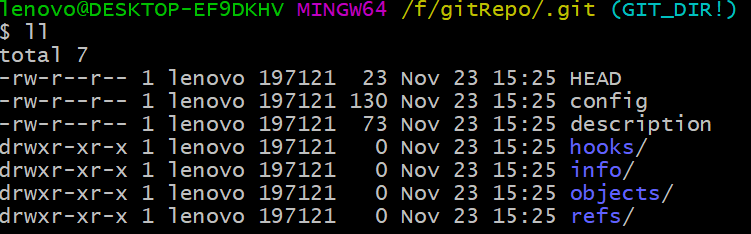
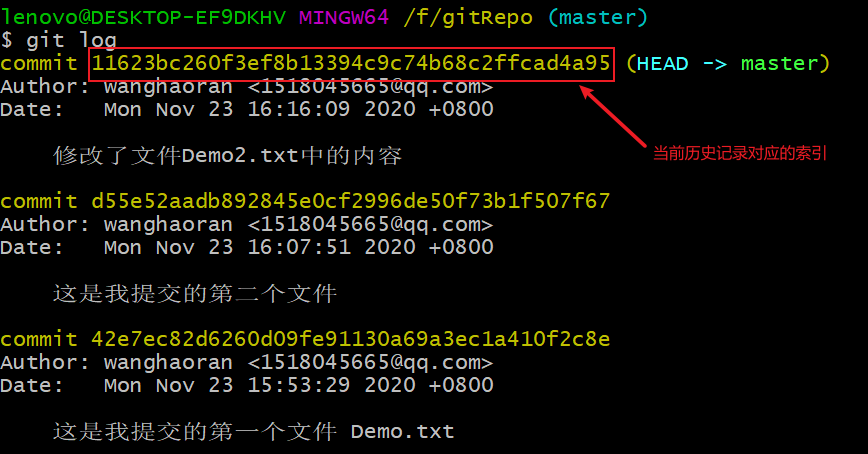

# Git

## Git安装

一直下一步即可

## Git本地结构


工作区：写代码的地方

暂存区：打算提交，还未提交

本地库：存储真正的历史版本 

## 代码托管中心_本地库和远程库的交互方式

1. 代码托管中心是干嘛的？

   我们已经有了本地库，本地库可以帮我们进行版本控制，为什么还需要代码托管中心？

   它的任务是帮我们维护远程库。

   下面说一下本地库和远程库的交互方式，也分为两种：

   1. 团队内部协作

   

   2. 跨团队协作

   

2. 托管中心种类：

   局域网环境下：可以搭建GitLab服务器作为代码托管中心，GitLab可以自己去搭建

   外网环境下：可以由GitHub或Gitee作为代码托管中心，GitHub或者Gitee是现成的托管中心，不用自己搭建

## 初始化本地仓库

1. 创建一个文件夹：

   

2. 打开Git终端：

   Git Bash Here-->进入之后先对字体和编码进行设置：

   右击-->选中options

   

   

   在Git中命令跟Linux是一样的：

   1. 查看Git安装版本：

      ```git
      $ git --version
      ```

   2. 清屏：

      ```
      $ clear
      ```

   3. 设置签名：

      设置用户名和邮箱：

      ```
      $ git config --global user.name "wanghaoran"
      $ git config --global user.email "1518045665@qq.com"
      ```

   4. 本地仓库的初始化：

      ```
      $ git init
      ```

      .git目录是隐藏的：可以调出来（也可以用命令`ll -la`查看）

   5. 查看.git下内容

      ```
      $ cd .git/
      $ ll
      ```

      

      **注意事项**：.git目录下的本地库相关的子目录和子文件不要删除，不要胡乱修改。

## Git常用命令

1. 提交文件到本地库

   1. 在本地仓库中创建文件

      

   2. 将文件提交到暂存区

      ```
      $ git add Demo.txt
      ```

   3. 将暂存区文件提交到本地库

      ```
      $ git commit -m "这是我提交的第一个文件 Demo.txt" Demo.txt
      ```

      

      -m 和""中的内容是配套的，目的是增加message，以便以后查看。

      注意事项：

      1. 不放在本地仓库中的文件，Git是不进行管理的。
      2. 即使放在本地仓库的文件，Git也不管理，必须通过add,commit命令操作才可以将内容提交到本地库。

2. git status 查看工作区和暂存区的状态

   ```
   $ git status
   ```

   - 创建一个文件，然后查看状态：

   

   表明文件Demo2.txt没有提交到暂存区。

   - 然后将Demo2.txt通过git add命令提交到暂存区，查看状态：

   

   表明文件Demo2.txt已提交到暂存区，但未提交到本地库。

   - 利用git commit命令提交到本地库：

   

   - 查看当前状态：

   

   表明本地仓库中的文件已经全部提交到本地库。

   - 现在修改Demo2.txt的内容，然后查看状态：

   

   - 将修改后的文件提交：

   

3. git log 查看日志

   ```
   $ git log
   ```

   

   当历史记录过多的时候，查看日志的时候，一页展示不下：

   - 下一页：空格
   - 上一页：b
   - 到尾页了，显示END
   - 退出：q

   日志展示方式：

   1. ```
      $ git log 
      ```

   2. ```
      $ git log --pretty=oneline
      ```

   3. ```
      $ git log --oneline
      ```

   4. ```
      $ git reflog
      ```

      多了信息：HEAD@{数字}

      这个数字的含义：指针回到当前这个历史版本需要走多少步

4. reset:前进或后退历史版本

   ```
   $ git reset --hard 索引号
   ```

   

   复制：在终端中选中就是复制

   粘贴：右键：paste

   

   查看本地仓库中的Demo2.txt文件，确实回退了

   

   现在后悔了，返回到insert状态：

   

   - hard参数：本地库的指针移动的同时，重置暂存区，重置工作区。
   - mixed参数：本地库的指针移动的同时，重置暂存区，但是工作区不动。
   - soft参数：本地库的指针移动的时候，暂存区、工作区都不动

   总结：以后用得多的就是hard参数

5. 删除文件_找回本地库删除的文件

   - 新建文件Test.txt，并放到本地库中。
   - 删除本地仓库(工作区)中的Test.txt文件

   ```
   $ rm Test.txt
   ```

   

   - 将删除操作同步到暂存区

   

   - 将删除操作同步到本地库

   

   - 查看日志：

   

   - 找回本地库中删除的文件，实际上就是将历史版本切换到刚才添加文件的那个版本即可：

   

6. 找回暂存区删除的文件

   - 删除工作区文件Test.txt,同步到暂存区

   - 后悔了，恢复暂存区数据：

     恢复方法和上面的一样

   

   这时候使用`git reset --hard HEAD`命令， 效果相同。

7. git diff命令

   ```
   $ git diff [文件名]
   ```

   将工作区中的文件和暂存区中文件进行比较

   ```
   $ git diff
   ```

   比较工作区中和暂存区中所有文件的差异

   ```
   $ git diff [索引号][文件名]
   ```

   比较暂存区和工作区中的内容
   
   

## 分支

### 1.什么是分支

1. 什么是分支：

   在版本控制过程中，使用多条线同时推进多个任务。这里面说的多条线，就是多个分支。 

2. 通过一张图展示分支：

   

3. 分支的好处：

   同时多个分支可以并行开发，互相不耽误，互相不影响，提高开发效率；

   如果有一个分支功能开发失败，直接删除这个分支就可以了，不会对其他分支产生任何影响。

### 2.操作分支

1. 查看分支

   ```
   $ git branch -v
   ```

   
   
2. 创建分支

   ```
   $ git branch [分支名]
   ```

   
   
3. 切换分支：

   ```
   $ git checkout [分支名]
   ```

   

4. 合并到主分支

   1. 进入主分支

   

   2. 合并分支

   ```
   $ git merge [分支名]
   ```

   

   分支冲突：

   

   解决：公司内部商议解决，决定要留下的。

   将工作区中内容添加到暂存区：

   

   然后进行commit操作：

   


# GitHub

## 创建GitHub远程库：


## 远程库的地址：


远程库地址比较长，每次复制比较麻烦，在Git中可以为远程库地址起别名：

- 查看别名：

```
$ git remote -v
```


- 起别名：

```
$ git remote add [别名][远程库地址]
```


## push操作

```
$ git push [远程库地址][分支名]
```


## clone操作

```
$ git clone [远程库地址]
```


clone操作可以帮我们完成：

1. 初始化本地库；
2. 将远程库内容完整地克隆到本地
3. 替我们创建远程库的别名


## 邀请成员加入团队

- push内容到远程库中去：

发现可以直接push进去，并没有让我录入账号密码，也没有提示错误--->结果很诡异

原因：git使用的时候在本地有缓存

将缓存清除：


- 现在再次push，发现出错了：


- 项目经理通过GitHub发出邀请


被邀请者接受邀请（在地址栏录入邀请链接即可）：


## 远程库修改的拉取

拉取操作pull，相当于fetch+merge

项目经理先确认远程库内容是否更新，

1. 先是抓取：

```
$ git fetch [远程库地址] [远程库对应分支名]
```


在抓取操作执行后，只是将远程库的内容下载到本地，但是工作区中的文件并没有更新，工作区中还是原来的内容。

抓取后可以去远程库看看内容是否正确：


然后发现内容都正确，就可以进行合并操作。在合并之前应该将分支切换回来：


2. 进行合并 merge：


以上2步可以直接用pull取代：

```
$ git pull [远程库地址] [分支名]
```

fetch+merge操作-->为了保险，慎重

pull-->代码简单，省事

## 协同开发时冲突的解决办法

在冲突的情况下，先应该拉取下来，然后修改冲突，最后再推送到远程服务器。

## 跨团队合作

1. 合作者得到远程库的地址；
2. 合作者进行fork操作；
3. 合作者clone到本地，可以进行修改、push到fork的远程库；
4. 合作者进行pull request操作；


5. 主创可以对请求审核

   

   可以互相留言；

   查看具体提交的内容：

   

   确定通过后，可以进行合并：

   

# SSH免密登录

1. 进入用户的主目录中：

   ```
   $ cd ~
   ```

2. 生成一个.ssh的文件夹（文件夹的位置在用户中）：

   ```
   $ ssh-keygen -t rsa -C [GitHub注册的邮箱]
   ```

   注意：C要大写，三次回车确认默认值即可。

   

3. 复制文件id_rsa.pub中的内容；

4. 打开GitHub

   

   

   
   
5. 生成密钥以后，就可以正常进行push操作了

   - 对SSH远程地址起别名

   ```
   $ git remote add [别名] [SSH远程地址]
   ```

   

   - 展示别名

   ```
   $ git remote -v
   ```

   

# IDEA集成Git

1. 正常创建一个Project
2. IDEA集成Git


3. Git初始化操作


本地库初始化完成了，生成了.git目录


## 在IDEA中使用Git的add, commit


## 使用idea拉取和推送资源

因为本地库和远程库是两个不同的项目，要把两个不同的项目合并，git需要添加一句代码，在`git pull`之后，这句代码是在git 2.9.2版本发生的，需要添加`--allow-unrelated-histories`告诉git允许不相关历史合并。

这个方法只解决因为两个仓库有不同的开始点，也就是两个仓库没有共同的commit出现的无法提交。

```
$ git pull [远程库地址] [分支名] --allow-unrelated-histories
```


push操作使用下面的命令：

```
$ git push -u [远程库地址] [分支名] -f
```


到这里远程库和本地库就可以进行交互了。

### 在IDEA中进行push


## IDEA clone远程库到本地


clone到本地后，gitRepo这个目录既变成了一个本地仓库，又变成了工作空间。

# 区别 git clone 与 git pull

## 1、git clone 与 git pull 相同点

相同点：都是从远程服务器拉取代码到本地

## 2、git clone 与 git pull 不同点

### git clone

是在本地没有版本库的时候，从远程服务器克隆整个版本库到本地，是一个本地从无到有的过程。

### git pull

在本地有版本库的情况下，从远程库获取最新commit 数据（如果有的话），并merge（合并）到本地。

git pull = git fetch + git merge

## 3、使用场景

通常情况下，远程操作的第一步，是使用git clone从远程主机克隆一个版本库到本地。

==本地修改代码后，每次从本地仓库push到远程仓库之前都要先进行git pull操作，保证push到远程仓库时没有版本冲突。==

